

  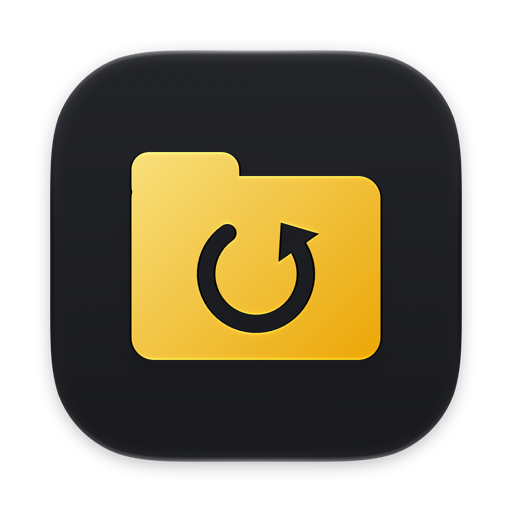

<h1 align="center">mmFolderBackup</h1>

  Sichert jeden Ordner mit einem Klick im Finder als ZIP – mit Datum und Uhrzeit im Namen, ganz im Hintergrund. 
  <a href="../../releases/latest"><b>Download</b></a> · <a href="#english">English</a>

<picture>
  <source media="(prefers-color-scheme: dark)" srcset="images/de/hero-dark.png">
  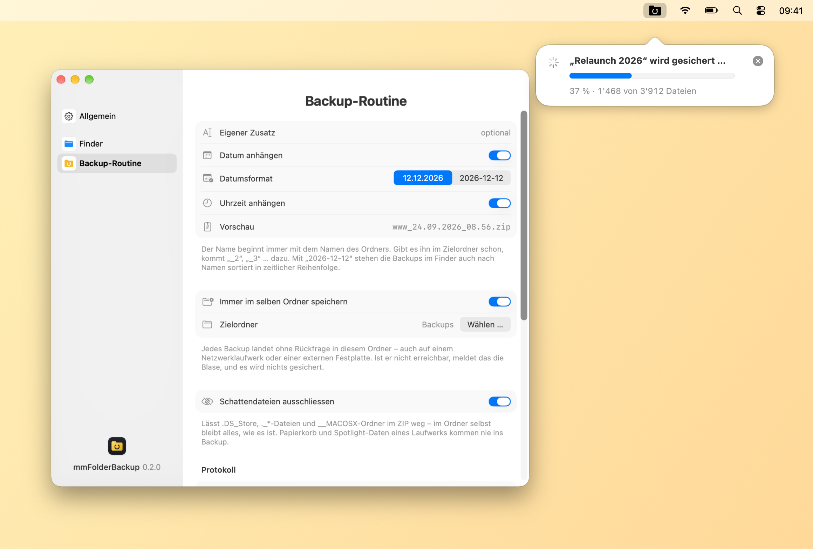
</picture>

## Funktionen

- **Ein Klick im Finder:** Der Backup-Knopf in der Symbolleiste sichert den Ordner, der im Fenster offen ist – samt allen Unterordnern – als ZIP. Ohne Menü, ohne weitere Schritte.
- **Sprechende Namen:** `www_12.12.2026_08.15.zip` – Name des Ordners, auf Wunsch ein eigener Zusatz, Datum (`12.12.2026` oder sortierbar `2026-12-12`) und Uhrzeit, jeweils ein- und ausschaltbar. Gibt es den Namen schon, kommt `_2`, `_3` … dazu; überschrieben wird nie etwas.
- **Fester Zielordner oder Nachfrage:** Entweder landet jedes Backup ohne Rückfrage in einem Ordner deiner Wahl – auch auf dem NAS oder einer externen Festplatte –, oder mmFolderBackup fragt jedes Mal und schlägt den zuletzt verwendeten Ordner vor.
- **Ohne Schattendateien:** Auf Wunsch bleiben `.DS_Store`, `._*` und `__MACOSX` draussen. Papierkorb und Spotlight-Daten eines Laufwerks kommen nie ins Backup.
- **ZIPs für alle:** Umlaute und Sonderzeichen in Dateinamen bleiben auch unter Windows lesbar, symbolische Links und Rechte bleiben erhalten, auch sehr grosse Ordner (über 4 GB, über 65’535 Dateien) funktionieren.
- **Fortschritt in der Menüleiste:** Eine Blase unter dem Symbol zeigt Prozent und Dateien, danach Name und Grösse des ZIP. Ist das Symbol ausgeblendet, erscheint sie oben rechts unter der Menüleiste.
- **Rechtsklick-Menü:** „Backup erzeugen“ für markierte Ordner oder den Fensterhintergrund; mehrere Ordner werden nacheinander gesichert.
- **Protokoll und Fehlerprotokoll:** Jedes Backup mit Ordner, ZIP, Grösse und Dauer; Dateien, die sich nicht lesen liessen, stehen im Fehlerprotokoll.
- **Signiert und notarisiert** mit einem Apple-Entwicklerzertifikat.
- **Menüleisten-App:** Symbol wählbar und ausblendbar, Start bei der Anmeldung, Erscheinungsbild Automatisch/Hell/Dunkel, automatische Updates nach Bestätigung, **Deutsch, Englisch, Französisch, Italienisch und Spanisch**, Liquid Glass ab macOS 26.

  <picture>
    <source media="(prefers-color-scheme: dark)" srcset="images/de/progress-dark.png">
    
  </picture>
  <picture>
    <source media="(prefers-color-scheme: dark)" srcset="images/de/result-dark.png">
    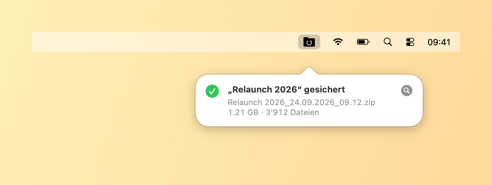
  </picture>

<picture>
  <source media="(prefers-color-scheme: dark)" srcset="images/de/menubar-dark.png">
  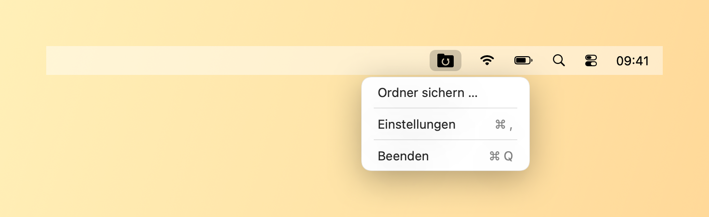
</picture>

## Einstellungen

  <picture>
    <source media="(prefers-color-scheme: dark)" srcset="images/de/settings-general-dark.png">
    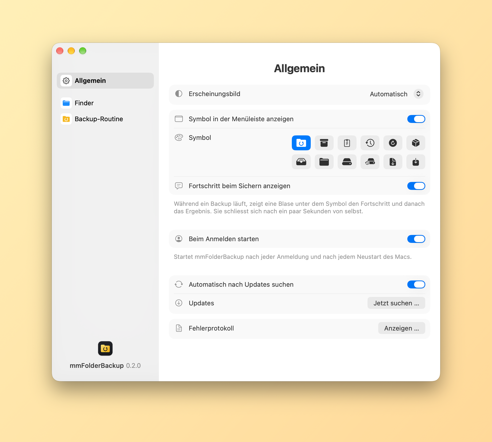
  </picture>
  <picture>
    <source media="(prefers-color-scheme: dark)" srcset="images/de/settings-finder-dark.png">
    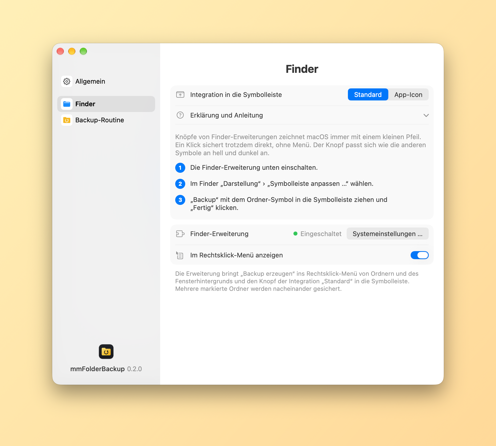
  </picture>

  <picture>
    <source media="(prefers-color-scheme: dark)" srcset="images/de/settings-routine-dark.png">
    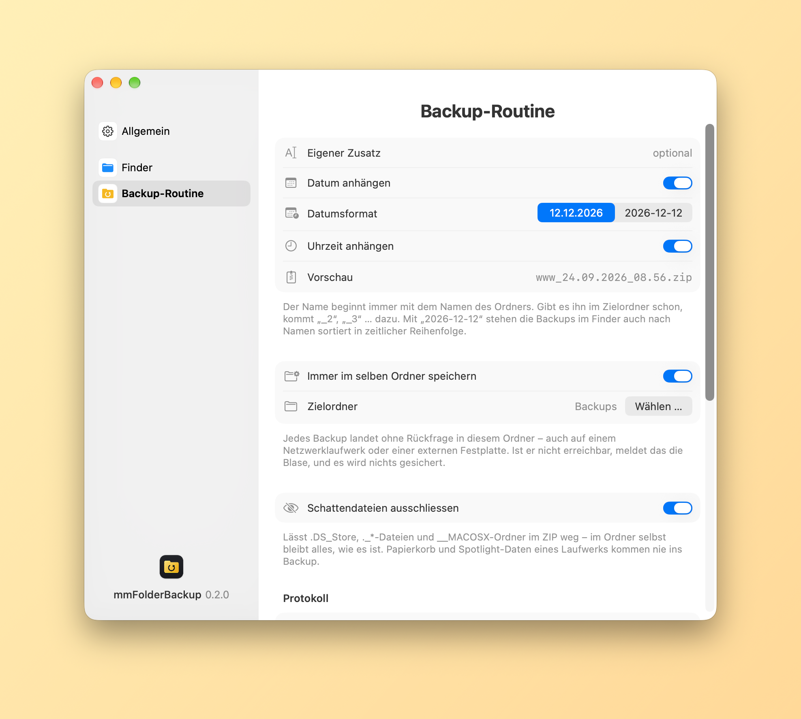
  </picture>
  <picture>
    <source media="(prefers-color-scheme: dark)" srcset="images/de/about-dark.png">
    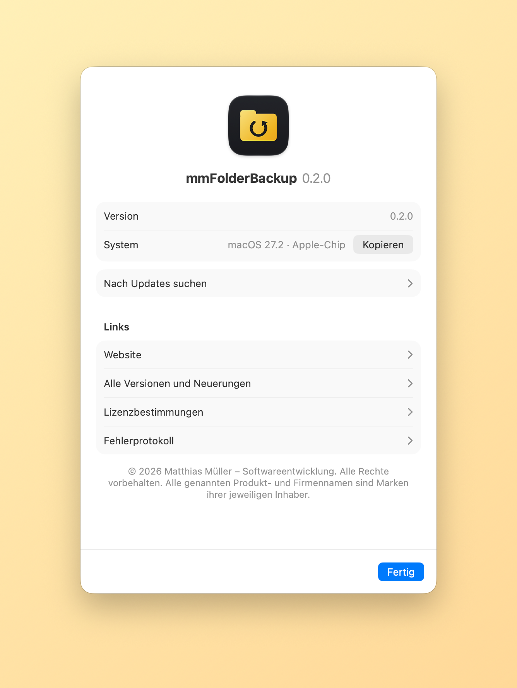
  </picture>

## Download und Installation

1. Unter [Releases](../../releases/latest) die Datei `mmFolderBackup-<Version>.dmg` herunterladen.
2. DMG öffnen und mmFolderBackup in den Ordner „Programme“ ziehen.
3. mmFolderBackup starten. Die App ist signiert und von Apple beglaubigt (notarisiert) und startet ohne Rückfrage. Wie der Backup-Knopf in den Finder kommt, zeigt die Seite „Finder“ in den Einstellungen und `Anleitung.txt` in der DMG.

> **Umstieg von 0.1.0:** Version 0.2.0 hat eine neue interne Kennung, deshalb kann die App sich nicht selbst darauf aktualisieren. Einmal die DMG laden und mmFolderBackup im Ordner „Programme“ ersetzen. Die Einstellungen werden übernommen; Finder-Erweiterung, Knopf in der Symbolleiste und „Beim Anmelden starten“ einmal neu einrichten.

Danach aktualisiert sich mmFolderBackup selbst: Die App sucht täglich nach neuen Versionen und installiert sie nach Bestätigung (Einstellungen › Allgemein › „Jetzt suchen …“).

## Der Backup-Knopf in der Symbolleiste

Die Seite „Finder“ in den Einstellungen erklärt beide Wege Schritt für Schritt:

- **Standard:** mmFolderBackup bringt eine Finder-Erweiterung mit. Einmal in den Systemeinstellungen einschalten, dann über „Darstellung › Symbolleiste anpassen …“ den Knopf „Backup“ in die Symbolleiste ziehen. Er passt sich wie die übrigen Finder-Symbole an hell und dunkel an; macOS zeichnet Knöpfe von Erweiterungen allerdings immer mit einem kleinen Pfeil. Die Erweiterung bringt auch „Backup erzeugen“ ins Rechtsklick-Menü.
- **App-Icon:** Wer den Pfeil nicht mag, zieht stattdessen das kleine Programm „Backup“ mit gedrückter ⌘-Taste in die Symbolleiste – ohne Pfeil, mit dem App-Icon. Beim ersten Klick fragt macOS einmal, ob mmFolderBackup den Finder steuern darf; nur so erfährt es, welcher Ordner offen ist.

## Voraussetzungen

- macOS 14 (Sonoma) oder neuer, Mac mit Apple-Chip oder Intel

---

## English

<picture>
  <source media="(prefers-color-scheme: dark)" srcset="images/en/hero-dark.png">
  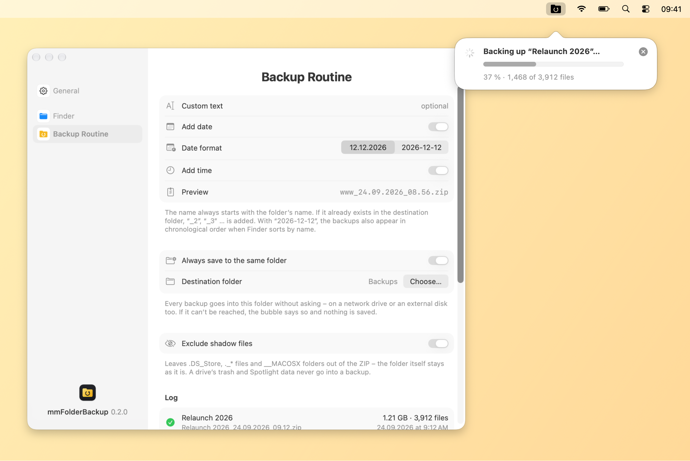
</picture>

mmFolderBackup saves any folder as a ZIP with one click in Finder – with date and time in the name, quietly in the background.

- **One click in Finder:** the Backup button in the toolbar saves the folder open in the window – including all subfolders – as a ZIP. No menu, no further steps.
- **Meaningful names:** `www_12.12.2026_08.15.zip` – the folder’s name, an optional text of your own, the date (`12.12.2026` or sortable `2026-12-12`) and the time, each of them optional. If the name is taken, `_2`, `_3` … is added; nothing is ever overwritten.
- **Fixed destination or ask:** either every backup goes into a folder of your choice without asking – on a NAS or an external disk too – or mmFolderBackup asks each time and suggests the folder used last.
- **Without shadow files:** if you like, `.DS_Store`, `._*` and `__MACOSX` stay out. A drive’s trash and Spotlight data never go into a backup.
- **ZIPs for everyone:** accented characters in file names stay readable on Windows too, symbolic links and permissions are kept, and very large folders (over 4 GB, over 65,535 files) work.
- **Progress in the menu bar:** a bubble below the icon shows percent and files, then the ZIP’s name and size. With the icon hidden, it appears at the top right below the menu bar.
- **Context menu:** “Create Backup” for selected folders or the window background; several folders are backed up one after the other.
- **Log and error log:** every backup with folder, ZIP, size and duration; files that couldn’t be read are listed in the error log.
- **Signed and notarized** with an Apple developer certificate.
- **Menu bar app:** choose or hide the icon, launch at login, appearance Automatic/Light/Dark, automatic updates once you confirm, **English, German, French, Italian and Spanish**, Liquid Glass on macOS 26 and later.

  <picture>
    <source media="(prefers-color-scheme: dark)" srcset="images/en/progress-dark.png">
    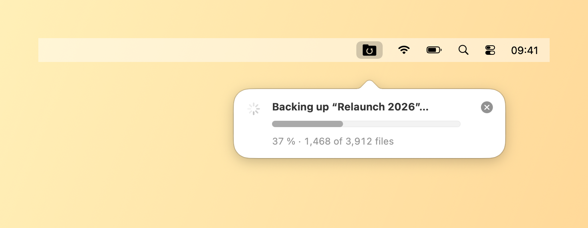
  </picture>
  <picture>
    <source media="(prefers-color-scheme: dark)" srcset="images/en/result-dark.png">
    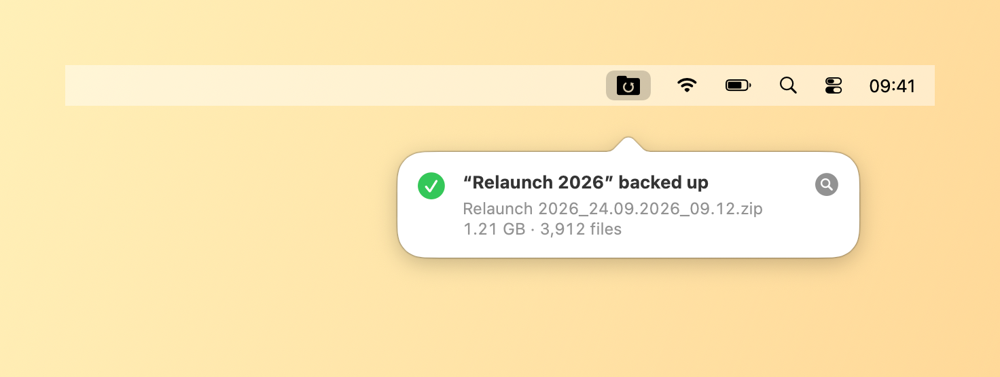
  </picture>

<picture>
  <source media="(prefers-color-scheme: dark)" srcset="images/en/menubar-dark.png">
  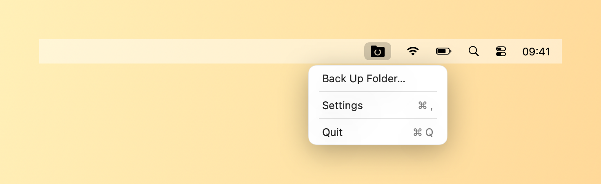
</picture>

  <picture>
    <source media="(prefers-color-scheme: dark)" srcset="images/en/settings-general-dark.png">
    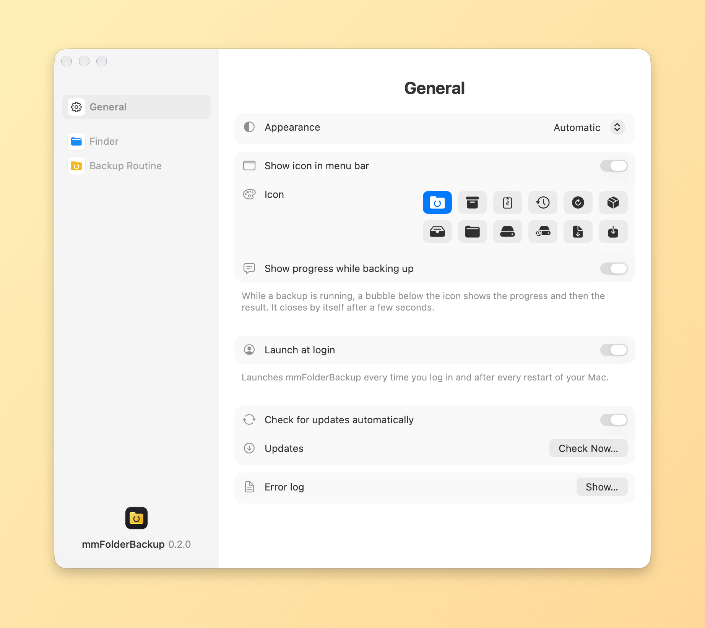
  </picture>
  <picture>
    <source media="(prefers-color-scheme: dark)" srcset="images/en/settings-finder-dark.png">
    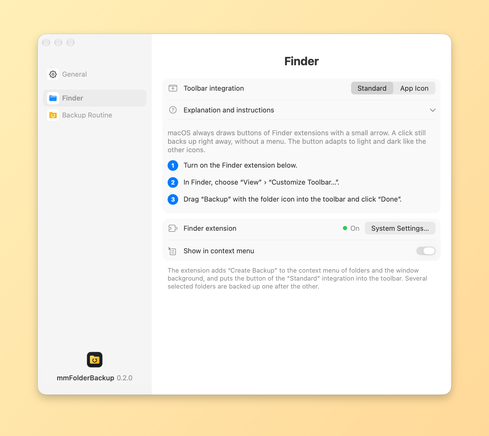
  </picture>

  <picture>
    <source media="(prefers-color-scheme: dark)" srcset="images/en/settings-routine-dark.png">
    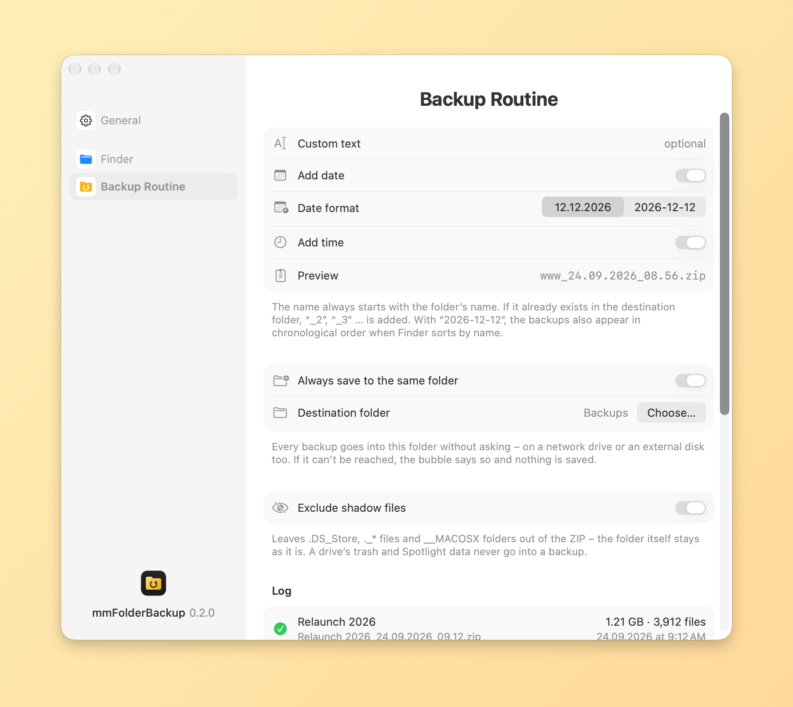
  </picture>
  <picture>
    <source media="(prefers-color-scheme: dark)" srcset="images/en/about-dark.png">
    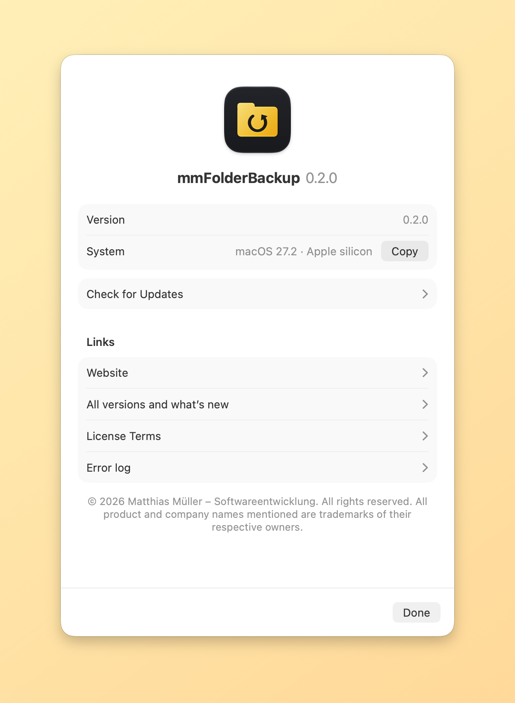
  </picture>

### Download and installation

1. Download `mmFolderBackup-<version>.dmg` from [Releases](../../releases/latest).
2. Open the disk image and drag mmFolderBackup to the Applications folder.
3. Launch mmFolderBackup. The app is signed and notarized by Apple, so it opens without any warning. The “Finder” page of the settings and `Anleitung.txt` inside the disk image show how the Backup button gets into Finder.

> **Coming from 0.1.0:** version 0.2.0 carries a new internal identifier, so the app cannot update itself to it. Download the disk image once and replace mmFolderBackup in your Applications folder. Your settings are carried over; set up the Finder extension, the toolbar button and “Launch at login” once more.

After that mmFolderBackup updates itself: it checks for new versions daily and installs them once you confirm (Settings › General › “Check Now…”).

### The Backup button in the toolbar

The “Finder” page of the settings explains both ways step by step:

- **Standard:** mmFolderBackup comes with a Finder extension. Switch it on once in System Settings, then drag “Backup” into the toolbar via “View › Customize Toolbar…”. The button adapts to light and dark like Finder’s other icons; macOS always draws buttons of extensions with a small arrow, though. The extension also adds “Create Backup” to the context menu.
- **App Icon:** if you don’t like the arrow, hold ⌘ and drag the small “Backup” app into the toolbar instead – no arrow, with the app icon. On the first click macOS asks once whether mmFolderBackup may control Finder; that’s how it learns which folder is open.

### Requirements

- macOS 14 (Sonoma) or later, Mac with Apple silicon or Intel

---

© 2026 Matthias Müller – Softwareentwicklung · Alle Rechte vorbehalten / All rights reserved · [Lizenzbestimmungen / License terms](LICENSE.md) · [www.mm-softwareentwicklung.de](https://www.mm-softwareentwicklung.de)

Alle genannten Produkt- und Firmennamen sind Marken ihrer jeweiligen Inhaber. 
All product and company names mentioned are trademarks of their respective owners.
